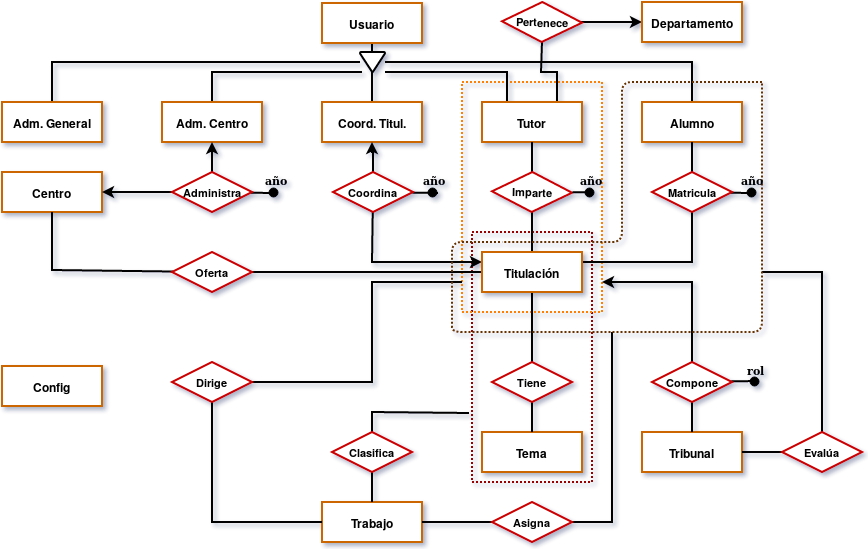

# Bachelor Thesis - Javier S. Lirola

The purpose of this bachelor thesis is to facilitate the task of management, both for the student and for the teaching staff, of the thesis of
the students.

Consist of a versatile application with basic functions so that the student can consult the complete process of his / her enrollment in the subject "Final Degree Project ", pre-assignment, assignment, project development, communication with the tutor, until the delivery and score through the court, also present in the system.

**Read full documentation [here](Documentation_ES.pdf) (Spanish).**

## Requirements (Laravel 5.5)

- PHP >= 7.0.0
- OpenSSL PHP Extension
- PDO PHP Extension
- Mbstring PHP Extension
- Tokenizer PHP Extension
- XML PHP Extension

## Database Diagram

